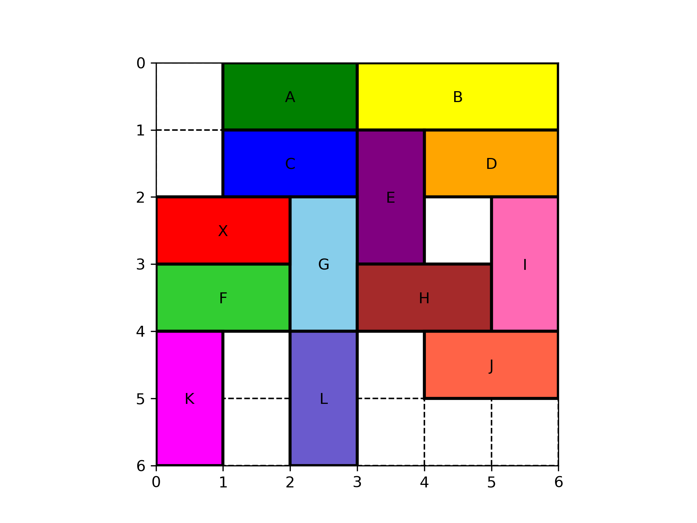

# Rush Hour

## Overview

**Rush Hour** is a Python-based implementation of the classic Rush Hour game, developed as part of a heuristics assignment. The game involves maneuvering vehicles on a grid-based board to clear a path for the red vehicle to exit



### Key Features
- Loads game boards from CSV file
- Supports different grid sizes: **6x6**, **9x9**, and **12x12**
- Vehicles of length 2 (cars) and 3 (trucks) with restricted movement (forward or backward only along their orientation)
- Comprehensive game rules implemented in Python
- Algorithms to solve the game with minimal steps
- Supports plotting the game state
- Tracks moves for export to CSV

---

## Project Layout
The project follows a modular structure for scalability and clarity:

```
<rush_hour_root_folder>/
    code/
        algorithms/
            __init__.py
            randomise.py
        classes/
            __init__.py
            board.py
            vehicle.py
        __init__.py
        helpers.py
    data/
        input/
            gameboards/
                Rushhour6x6_1.csv
                Rushhour6x6_2.csv
                Rushhour6x6_3.csv
                Rushhour9x9_4.csv
                Rushhour9x9_5.csv
                Rushhour9x9_6.csv
                Rushhour12x12_7.csv
            test_boards/
                Rushhour6x6_advanced_1.csv
                Rushhour6x6_advanced_2.csv
                Rushhour6x6_advanced_3.csv
                Rushhour6x6_expert_1.csv
                Rushhour6x6_expert_2.csv
                Rushhour6x6_expert_3.csv
                Rushhour6x6_test.csv
        output/
    docs/
        Baseline/
            images/
            Baseline.md
        images/
        Algorithms.md
        Representation.md
        README.md
    tests/
        __init__.py
        board_test.py
        vehicle_test.py
    .editorconfig
    .gitignore
    main.py
    requirements.txt
    README.md
```

### Folder and files breakdown

- <rush_hour_root_folder>/
    - **`code/`**: Contains the core implementation of the game
        - **`algorithms/`**: Heuristic and randomization algorithms
            - `__init__.py`
            - `randomize.py`: Implements randomization algorithms for solving the game
        - **`classes/`**: Representations of the core objects
            - `__init__.py`
            - `board.py`: Represents the game board and manages vehicle placements and moves
            - `vehicle.py`: Represents vehicles, tracking their attributes and movements
        - `__init__.py`
        - `helpers.py`: Utility functions to support game logic
      - **`data/`**: Data folder for ingesting game boards and storing solutions
        - **`input/`**: Contains game boards to ingest
            - **`gameboards/`**: Contains 7 game boards to solve.
            - **`test_boards/`**: Contains game boards used for testing our algorithms and representation
        - **`output/`**: Folder for storing game solutions and exporting game state visualization
    - **`docs/`**: Documentation for the project's design, planning and results
        - **`Baseline/`**: Contains data and images related to the results of randomization algorithms
            - `images/`: Visualizations of baseline measurement results
            - `Baseline.md`: Documents the baseline results and statistical insights
        - **`images/`**: Images used in the various documents
        - `Algorithms.md`: Explains the solving algorithms implemented in the project
        - `Representation.md`: Details the representation choices for modeling the game
        - `README.md`: Overview of the documentation folder and its purpose
    - **`tests/`**: Unit tests for ensuring the correctness of core functionality
        - `__init__.py`
        - `board_test.py`: Tests for the `Board` class
        - `vehicle_test.py`: Tests for the `Vehicle` class
    - `.editorconfig`: Defines consistent coding styles across different editors
    - `.gitignore`: Specifies files and directories to intentionally ignore by `git`
    - `main.py`: Entry point for running the code
    - `requirements.txt`: Lists Python package dependencies
    - `README.md`: This documentation file

---

## Additional documentation:
- [Docs](docs)
  - [Representation](docs/Representation.md)
  - [Algorithms](docs/Algorithms.md)
  - [Baseline measurements](docs/Baseline/Baseline.md)

---

## Setup and Installation

### Prerequisites
- Python 3.10 or later

### Installation Steps
1. Clone the repository:
   ```bash
   git clone https://github.com/MinAiSpaces/rushhour.git <rush_hour_root_folder>
   cd <rush_hour_folder_name>
   ```
2. Create a virtual environment (optional but recommended):
   ```bash
   python3 -m venv rushhour
   source venv/bin/activate    # On Windows: venv\Scripts\activate
   ```
3. Install dependencies:
   ```bash
   pip install -r requirement.txt
   ```

## Running the Project
1. Navigate to the `<rush_hour_folder_name>`
   ```bash
   cd <rush_hour_folder_name>
    ```
2. Run the main script to start the game:
   ```bash
   python main.py
   ```

## Running the Test Suite
1. Navigate to the `<rush_hour_folder_name>`.
   ```bash
   cd <rush_hour_folder_name>
   ```
2. Run all tests using the `unittest` module:
   ```bash
   python -m unittest discover -s tests -p "*.py" -v
   ```
3. To run a specific test file:
   ```bash
   python -m unittest tests/vehicle_test.py -v
   ```

## Goals
- Implement advanced solving algorithms, including:
  - Naive randomization
  - BFS (Breadth-First Search)
  - DFS (Depth-First Search)
  - A* (A-Star) Search

---

Enjoy solving puzzles with **Rush Hour**!

