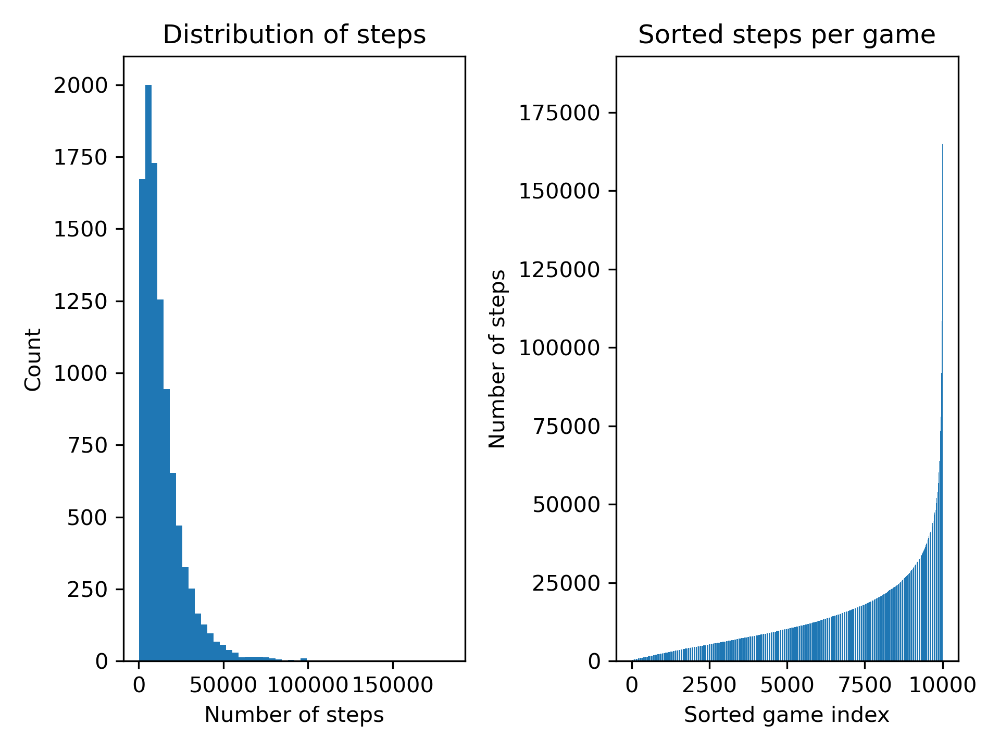

# Baseline measurements

## Intro

We've run the algorithm 10,000 times for each board and each algorithm. Whenever a board was solved, we tracked how many moves it took for the algorithm to find a solution. The number of moves necessary was then stored so that we could perform some basic statistical calculations on them and plot both a distribution graph and a graph of the sorted list of number of moves, showing the difference in the number of moves over 10,000 runs.

## Algorithm 1: Uniform randomization of all available valid moves

### Performance

- #### Test Boards
    - Board 1 (6x6) - 13 vehicles: **5,835.64 moves** (average over 10_000 runs)
    - Board 2 (6x6) - 13 vehicles: **1290.55 moves**
    - Board 3 (6x6) - 9 vehicles: **17,076.55 moves**
    - Board 4 (9x9) - 22 vehicles: **11,477.30 moves**
    - Board 5 (9x9) - 24 vehicles: **21,606.59 moves**
    - Board 6 (9x9) - 26 vehicles: **13,888.05 moves**
    - Board 7 (12x12) - 44 vehicles: **21,478.40 moves**

- #### Findings

## Algorithm 2: Randomization vehicle first

### Performance

- #### Test Boards
    - Board 1 (6x6) - 13 vehicles: **8,221.35 moves** (average over 10_000 runs)
    - Board 2 (6x6) - 13 vehicles: **1,570.40 moves**
    - Board 3 (6x6) - 9 vehicles: **16,443.25 moves**
    - Board 4 (9x9) - 22 vehicles: **17,447.04 moves**
    - Board 5 (9x9) - 24 vehicles: **24,055.37 moves**
    - Board 6 (9x9) - 26 vehicles: **17,329.71 moves**
    - Board 7 (12x12) - 44 vehicles: **31,64.73 moves**

- #### Findings

## Overall observations

Our first observation was that the random algorithms used were able to solve all games.

Secondly, we've observed that randomization algorithm `Algorithm 1` performed better on all boards (except for `Board 3 (6x6)`).

Furthermore, we've observed that the distribution of necessary number of moves per board are all right skewed.

And finally we've observed the extreme range of moves made by the algorithms on some boards like `Board 6`.

## Analysis

The first observation indicates that the state space can be randomly searched in a reasonable amount of time.

The fact that `Algorithm 1` seems to be performing better could mean that there is information hidden in the fact a vehicles has more available moves. It looks like picking a vehicle with more available moves reduces the number of moves needed to solve a board.

Regarding the fact the distributions are all right skewed might be explained by the fact that the algorithm can get 'stuck' in a loop or in a 'funnel state', a state where there is only a small probability to escape from.

Finally, the large range observed in some solution could be explained by the before mentioned.

## Figures

### Board 1

- Algorithm 1
  

- Algorithm 2
  

### Board 2
- Algorithm 1
  

- Algorithm 2
  

### Board 3
- Algorithm 1
  

- Algorithm 2
  

### Board 4
- Algorithm 1
  

- Algorithm 2
  

### Board 5
- Algorithm 1
  

- Algorithm 2
  

### Board 6
- Algorithm 1
  

- Algorithm 2
  

### Board 7
- Algorithm 1
  

- Algorithm 2
  
