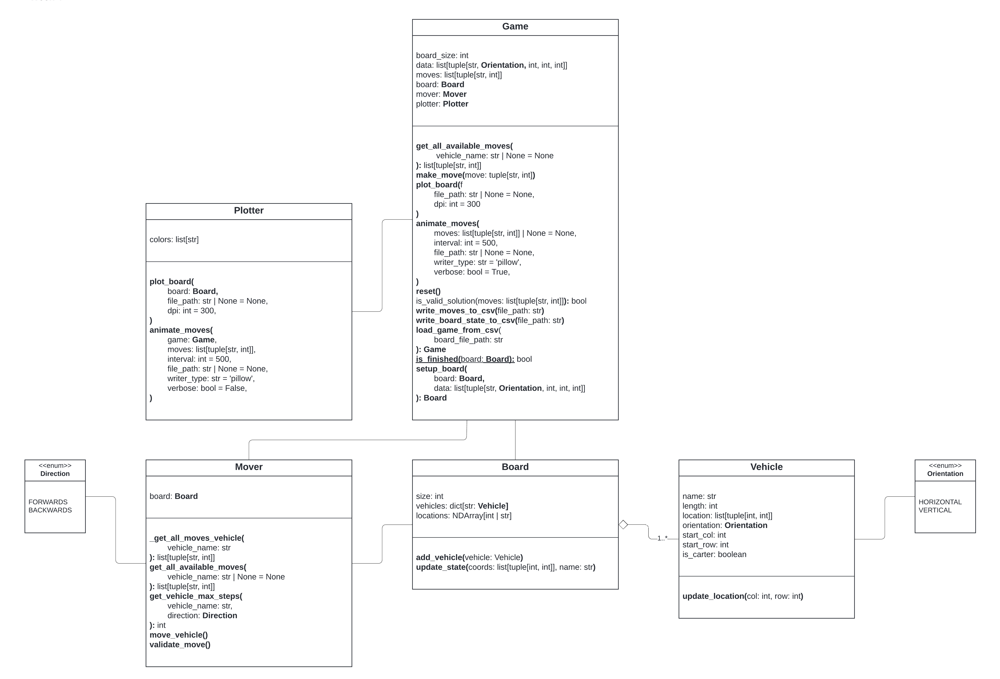
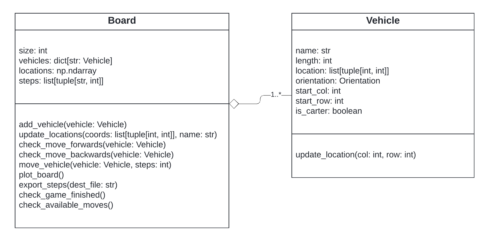
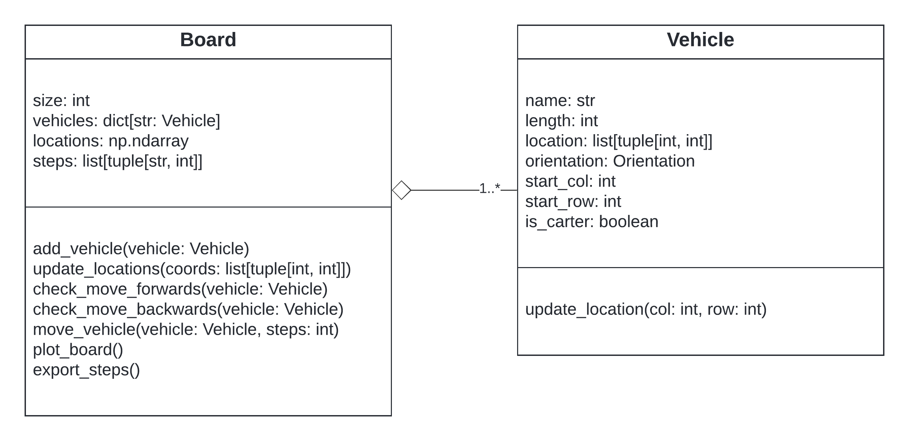

# Representation and assumptions

## The game

The game revolves around placing a number of vehicles on a square grid game board. Vehicles can be either 2 grid units long, representing cars, or 3 grid units long, representing trucks. Every game features one red car, 2 units long, which we’ve named **Carter**.

The rules are simple: every vehicle is placed on the board with its front either facing right (horizontal orientation) or facing down (vertical orientation). Once placed in their starting positions, vehicles can only move forward or backward within their respective row or column. Vehicles cannot be placed on top of each other, nor can they cross one another.

The objective of the game is to move Carter forward until it reaches the border of the game board. Players can move only one vehicle at a time, and each move can be in either a forward or backward direction. The number of steps a vehicle can move is limited only by the number of available spots immediately in front of or behind it.

Every move counts as a step, and the goal is to get Carter out of the board in the least number of steps.

---

## Representation choices

The game and its mechanics are implemented in **Python**, following an **object-oriented programming (OOP) paradigm**.

Our initial setup included two primary classes: the `Board` class and the `Vehicle` class. The `Board` class represents the game board, which is initialized with a specific size and was responsible for managing the placement and movement of vehicles.
The `Vehicle` class defined individual vehicle objects, tracking attributes such as their name, length, orientation, and current position on the board.

However, we have since simplified the `Board` and `Vehicle` classes and expanded the project structure with `Game`, `Mover` and `Plotter` classes in order to ensure single responsibility of classes as much as possible.

The `Game` class now serves as the central interface, handling board setup, move execution, tracking move history, and game visualization.

---

## Class structure - Week 3 & 4

### Game
- Manages board setup, vehicle placement, move validation, and tracking move history.
- Encapsulates `Board`, `Mover`, and `Plotter` for modularity.
- Tracks Moves via `self.moves` and provides file I/O for move storage.

### Board
- Stores the game grid and a dictionary of all placed vehicles.
- Handles vehicle placement and board updates after moves.
- Provides board state representation for move validation.

### Vehicle
- Represents individual vehicles with unique names, orientation, and length.
- Stores movement constraints based on orientation.
- Tracks position dynamically as moves are executed.

### Mover
- Handles move validation before execution.
- Determines possible moves for each vehicle at any given state.
- Executes valid moves and updates the board state.

### Plotter
- Handles board visualization using Matplotlib.
- Supports static board plotting and animated move sequences.
- Provides file export options for board states.

---

## Assumptions

### Carter

- The red car, Carter, can only be placed in a horizontal orientation

### Moves

- A forward move is indicated by a positive integer, and a backward move by a negative integer.
- Forward moves are calculated from the coordinates of the front of the vehicle, while backward moves are calculated from the coordinates of the back of the vehicle.

### Valid moves only

- Vehicles can only move along their orientation (horizontal or vertical) and cannot jump rows or columns respectively.
- Moves are blocked by other vehicles or the edges of the board.
- Vehicles can't be placed on top of each other.
- Vehicles can't jump over or pass through a vehicle blocking their path.

### Game end

- The game ends when Carter reaches or is placed on the outermost grid square in front of it.
- This last move counts towards the number of moves.

---

## Changelog

### Week 2

In week 2 we still only had 2 classes but the `Board` gained some additional functionality.

While the `Board` class grew in bigger and bigger it became clear we needed to split responsibilities.

#### Additions:
- **check_game_finished()**: Check to see if **Carter** is in the end game position
- **check_available_moves()**: Check all available moves by iterating over vehicles and seeing which ones could make valid moves

---

### Week 1

We started out with just 2 classes. A `Board` and a `Vehicle` class.

This simple setup allowed us to test the game logic and even allowed us to plot a board and it's vehicle positions.
